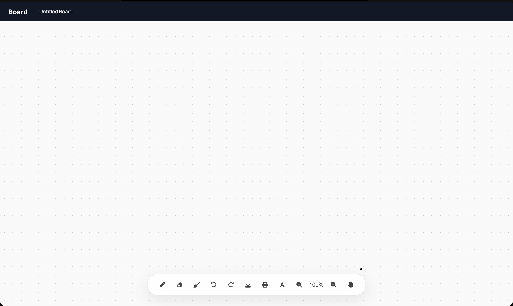

# Board - Digital Whiteboard

A lightweight, highly responsive, and feature-rich digital whiteboard. Designed for a smooth, distraction-free drawing experience, it features an infinite panning workspace, retina-ready rendering, and velocity-sensitive brush strokes.

## ✨ Features

* **Canvas Workspace:** The canvas is expanded 3x the size of your monitor. Use the Hand tool to freely pan around your workspace.
* **Smart Zoom :** Zoom in and out seamlessly. The background dot-grid scales perfectly with your zoom level, and your camera position is automatically saved.
* **Velocity-Sensitive Pen:** Brush strokes dynamically adjust their width based on how fast you draw and give you ink-like experiance.
* **Text Tool:** Click anywhere on the canvas to spawn a text box, type, and click away to stamp the text directly onto the board.
* **Retina/HiDPI Ready:** Fully utilizes `devicePixelRatio` to ensure all ink and text remains incredibly crisp on high-resolution displays.
* **Auto-Save:** Your drawings and your exact camera coordinates are continuously saved to `localStorage`. Refreshing the page instantly brings you back exactly where you left off.
* **Full History Control:** Robust Undo/Redo stack allows you to safely step back through your mistakes.
* **Export & Print:** Download your whiteboard as a clean PNG or send it directly to your printer.
* **Sleek UI:** Features a modern, non-intrusive bottom toolbar with a (`backdrop-filter`) effect and dynamic tools that auto-hide when drawing.

## 🛠️ Tech Stack

* **HTML5 Canvas:** For high-performance raster drawing.
* **Vanilla JavaScript:** Zero heavy frameworks. All state management, DOM manipulation, and math handled natively.
* **CSS3:** Custom range sliders, absolute/fixed positioning, and modern blur filters.
* **[Mousetrap.js](https://craig.is/killing/mice):** For reliable, cross-browser keyboard shortcut bindings.
* **FontAwesome:** For lightweight, scalable UI icons.

## How to Use

1. Clone or download this repository.
2. Open `index.html` in any modern web browser (Brave, Chrome, Firefox, Safari).
3. Start drawing!

## ⌨️ Keyboard Shortcuts

Speed up your workflow by keeping one hand on the keyboard and the other on your mouse/stylus:

| Shortcut | Action |
| :--- | :--- |
| `P` | Switch to **Pen** Tool |
| `E` | Switch to **Eraser** Tool |
| `T` | Switch to **Text** Tool |
| `H` | Switch to **Hand / Pan** Tool |
| `C` | **Clear** the entire board |
| `Cmd/Ctrl + Z` | **Undo** last action |
| `Cmd/Ctrl + Shift + Z` (or `Cmd+Y`) | **Redo** last action |

## 📁 File Structure
* `index.html`: The main layout and UI structure.
* `style.css`: All styling, including the dark-mode navbar and toolbar.
* `script.js`: The core application engine (Canvas context, tool logic, event listeners, and math).
